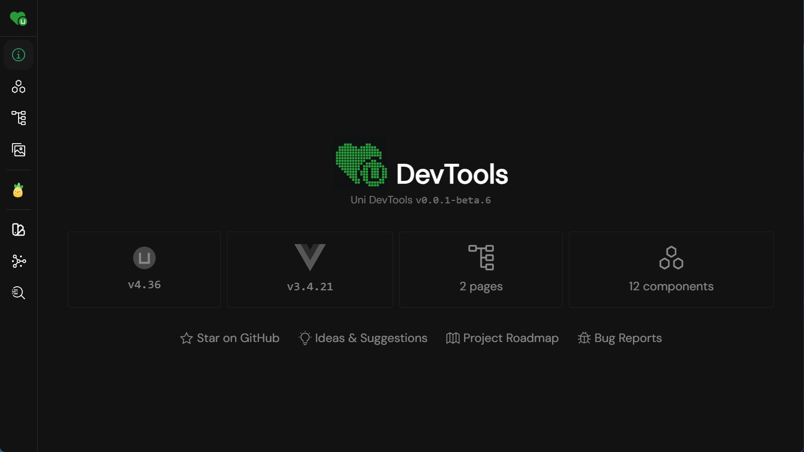

# 🔺🔹🔸🔻Uni DevTools

<pre align="center">
🏗 Working in Progress
</pre>

</br>

<p align="center"></p>

## Install

```bash
pnpm add -D @uni-helper/devtools
```

## Usage

```ts
import { defineConfig } from 'vite'
import Uni from '@dcloudio/vite-plugin-uni'
import DevTools from '@uni-helper/devtools'

export default defineConfig({
  plugins: [
    DevTools({
      openDesktop: true,
    }),
    Uni(),
  ],
})
```

## 💻 Development

- Clone this repository
- Install dependencies using `pnpm install`
- Start development server using `pnpm dev`
- Run interactive tests using `pnpm play`

## 💝 Contributors

This project exists thanks to all the people who contribute.

## 🙇🏻‍♂️ [sponsors](https://afdian.com/a/flippedround)

<p align="center">
  <a href="https://afdian.com/a/flippedround">
    
  </a>
</p>
