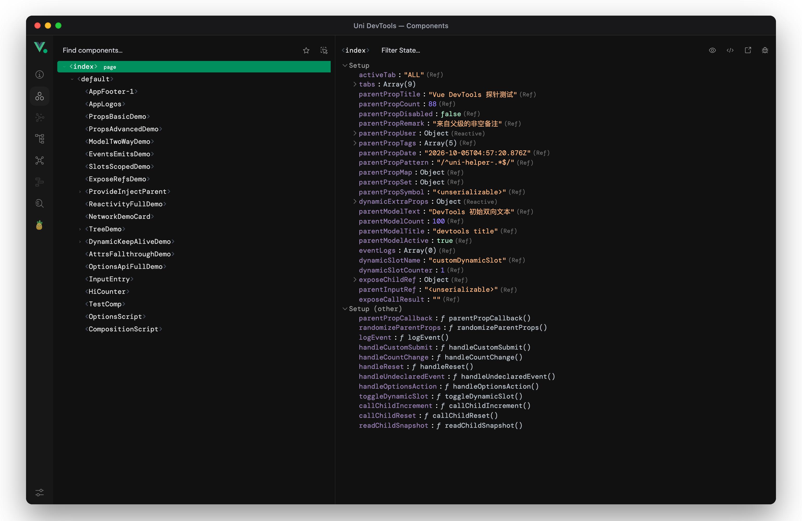
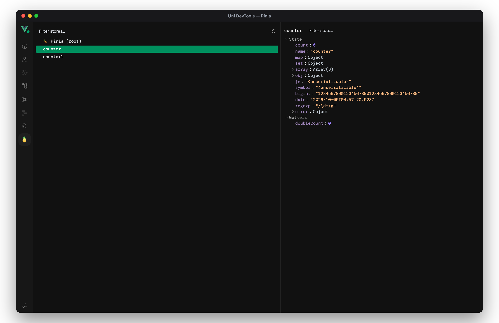
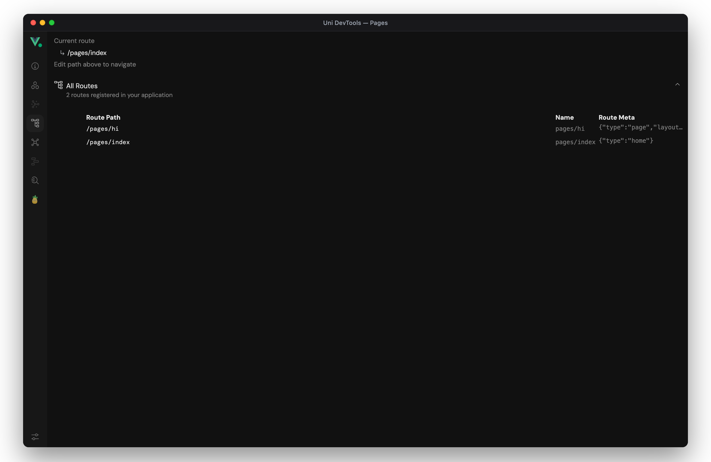

# 🔺🔹🔸🔻 Uni DevTools

<p align="center">
  <b>为 uni-app（尤其是小程序场景）打造的现代化 DevTools</b><br>
  将官方 Vue DevTools v9 的原生体验与强大能力带入跨端生态。
</p>

<pre align="center">
🏗 基于 Devframe 基础设施与官方 Vue DevTools 架构全新重构
</pre>

</br>

<p align="center">
  
</p>

---

## 🌟 核心特性

Uni DevTools 解决了 uni-app 小程序开发中编译后信息丢失、闭包变量不可见以及调试工具生态割裂的核心痛点：

- 🌳 **组件树与状态检视（Components & State）**

  - **多页面即多 App**：将小程序独有的页面栈与分包体系天然映射为独立的 App 实例快照（`route#uid` 隔离）。
  - **组件文件名还原**：编译期 AST 插桩自动注入 `__file` 元信息，精准还原匿名组件与 SFC 真实文件名。
  - **毫秒级实时推送**：基于渲染钩子包装（Render Hook），组件更新时在约 0.3s 内防抖推送到面板，无需手动轮询。
  - **官方规范状态检视**：严格对齐官方 `props` / `data` / `setup` / `computed` / `attrs` 分组，附带 `(Ref)`、`(Reactive)`、`(Computed)` 徽标与原始定义提示。
  - **深路径状态编辑**：支持顶层变量、深层嵌套对象路径、数组下标的实时修改与属性删除。
  - **查看渲染函数源码（Show Render Code）**：在面板中直接查看组件脱壳去插桩后的编译期 render 函数。
  - **源码一键直达（Open in Editor）**：从组件树或状态面板一键在本地编辑器（VS Code 等）打开对应源码文件（内置项目根安全守卫）。

- 🍍 **Pinia 状态检查器（Pinia Inspector）**

  - **零侵入自动发现**：运行时自动探测全局激活的 Pinia Store 实例（免手动挂载/注入代理）。
  - **官方 UI 拓扑对齐**：完美还原官方 `🍍 Pinia (root)` 聚合看板与各 Store 平级视图。
  - **双向同步与刷新**：支持深层 State 编辑与修改回写，修改后触发失效事件驱动 UI 实时刷新。

  <p align="center">
    
  </p>

- 🗺️ **路由与页面栈（Pages & Navigation）**

  - **注册路由解析**：自动解析 `pages.json`（支持注释、尾随逗号及 subPackages 分包路由）。
  - **实时页面栈监控**：动态展示当前小程序页面栈深度与路由参数（`getCurrentPages()`）。
  - **面板交互导航**：直接在 DevTools 中触发 `navigateTo`、`redirectTo` 与 `switchTab`。

  <p align="center">
    
  </p>

- 🕸️ **响应式图谱（Reactivity Graph）**

  - **深入链表追踪**：基于 Vue 3.5+ 响应式系统的 `deps`/`subs` 双向链表，递归收集组件内的响应式依赖拓扑。
  - **力导向拓扑呈现**：基于 d3-force 力导向图直观呈现 Setup 变量与 Render / Watch 之间的依赖关系。
  - **版本门禁放宽与引导**：官方 3.6.0 门槛针对小程序生态合理放宽至 Vue 3.5.0；低于 3.5 时在页面内提供明确指引而非静默隐藏。

- 🌐 **网络请求看板（Network Inspector）**

  - **全链路流量捕获**：深度拦截 `uni.request`、`uni.uploadFile`、`uni.downloadFile`，无侵入采集网络调用。
  - **时序流与瀑布图（Waterfall）**：按发起顺序呈现请求流，提供精准的瀑布耗时条形图，动态展示在途 `(pending)` 状态并在完成后原行就地结算。
  - **完整报文抽屉**：支持查看 Headers、Query、Request Body、Response Body 及性能耗时指标。
  - **增量同步与幂等合并**：探针端环形缓冲结合水位与脏集机制，保证高频网络调用不漏推、不饿死。
  - **AI Agent 友好**：暴露标准的 `get-network-records` RPC 接口，为 AI Coding Agent 提供可直接消费的网络诊断数据。

- 🔍 **构建管线检查（Vite Inspect）**
  - 集成 `vite-plugin-inspect`，支持在独立直连面板中快速检查 Vite 插件管道转换流程、耗时热点与中间代码产物。

---

## 🏗 系统架构

Uni DevTools 采用清晰的四层解耦架构，面板直接复用官方 Vue DevTools client 并通过核心协议适配层抹平跨端差异：

```
┌────────────────────────────────────────────────────────┐
│                   小程序运行时 (Agent)                  │
│   (沙箱探针：拦截路由/Pinia/组件树/网络，吐出私有 RPC)    │
└───────────────────────────┬────────────────────────────┘
                            │ WebSocket
┌───────────────────────────▼────────────────────────────┐
│                  Node 中继与 Vite 插件                  │
│    (Devframe Sidecar：纯管道转发 + 编译期 AST 插桩)    │
└───────────────────────────┬────────────────────────────┘
                            │ Devframe RPC
┌───────────────────────────▼────────────────────────────┐
│                 核心协议适配层 (Adapter)                │
│    (uni-devtools-rpc + mapping：将私有协议翻译为 kit)   │
└───────────────────────────┬────────────────────────────┘
                            │ DevtoolsRpcClient (npm kit)
┌───────────────────────────▼────────────────────────────┐
│                    官方 UI 面板 (Panel)                │
│  (移植自官方 Vue DevTools v9 client SPA，零侵入无缝驱动) │
└────────────────────────────────────────────────────────┘
```

> 详细架构设计与协议映射原理请参阅 [架构与核心设计（白话版）](docs/ARCHITECTURE_PLAIN.md)。

---

## 📦 安装与使用

### 1. 安装插件

在你的 uni-app 项目中安装开发依赖：

```bash
pnpm add -D @uni-helper/devtools-devframe
```

### 2. 配置 Vite 插件

在 `vite.config.ts` 中引入并注册 `UniDevtoolsPlugin`（建议置于 `Uni()` 之前）：

```ts
import { defineConfig } from 'vite'
import Uni from '@dcloudio/vite-plugin-uni'
import { UniDevtoolsPlugin } from '@uni-helper/devtools-devframe/plugin'

export default defineConfig({
  plugins: [
    UniDevtoolsPlugin(),
    Uni(),
  ],
})
```

### 3. 运行调试

启动小程序开发构建（以微信小程序为例）：

```bash
pnpm dev:mp-weixin
```

编译完成后，终端将输出专属的 DevTools 面板访问地址（包含鉴权 Token）。在现代浏览器中打开该 URL，并在微信开发者工具中开启服务端口与不校验合法域名，即可开始调试。

### 4. 配置编辑器集成（可选）

"Open in Editor"功能可让你从面板直接在本地编辑器中打开源码文件。

**VS Code 用户（推荐）：**

1. 打开 VS Code
2. 按 `Cmd+Shift+P`（Mac）或 `Ctrl+Shift+P`（Windows/Linux）
3. 输入并执行：`Shell Command: Install 'code' command in PATH`
4. 重启终端

**其他编辑器：**

设置 `LAUNCH_EDITOR` 环境变量：

```bash
# VS Code
export LAUNCH_EDITOR=code

# Cursor
export LAUNCH_EDITOR=cursor

# WebStorm
export LAUNCH_EDITOR=webstorm

# Sublime Text
export LAUNCH_EDITOR=subl
```

或在项目的 `.env` 文件中配置：

```env
LAUNCH_EDITOR=code
```

**验证配置：**

```bash
# 检查编辑器命令是否可用
which code  # 应该输出编辑器路径
```

详细配置指南：[launch-editor 使用文档](https://github.com/yyx990803/launch-editor#usage)

---

## 📂 仓库结构

本项目采用 pnpm workspace monorepo 结构进行管理：

```
packages/
├── devframe/         # Vite 插件、Node 侧 Sidecar、AST 插桩与小程序探针 (Agent)
│   ├── src/agent/    # 小程序沙箱运行时探针（组件树、状态、Pinia、网络、依赖图等）
│   ├── src/plugin.ts # Vite 插件入口，集成编译期插桩与 Devframe 伴生服务
│   └── src/devframe.ts # Devframe 定义与 18 个核心 RPC 接口
├── panel/            # 官方 Vue DevTools client 移植版 SPA 面板
│   ├── src/adapter/  # 核心协议转换桥（uni-devtools-rpc.ts 及 mapping 转换纯函数）
│   └── src/pages/    # Components, Pinia, Pages, Graph, Network, Inspect 等页面
playground/
├── vue3-vite/        # uni-app Vue3 + Vite 小程序示例项目，集成全场景测试用例
└── vue2-webpack/     # uni-app Vue2 + webpack4 示例
docs/                 # 核心架构与演进文档
```

---

## 💻 本地开发

### 环境准备

- Node.js >= 18.0.0
- pnpm >= 9.0.0

```bash
# 1. 克隆代码仓库
git clone https://github.com/uni-helper/devtools.git
cd devtools

# 2. 安装依赖
pnpm install
```

### 构建与调试

```bash
# 构建 devframe 插件产物（更新 src 代码后必需）
pnpm --filter @uni-helper/devtools-devframe build

# 构建前端面板产物（被 sidecar 托管）
pnpm --filter @uni-helper/devtools-panel build

# 启动小程序示例测试（监控模式）
pnpm play
# 或进入 playground/vue3-vite 独立运行：
# cd playground/vue3-vite && pnpm dev:mp-weixin

# 独立启动面板开发服务器（支持无需后端的 Mock 模式：访问 http://localhost:5173/?mock）
pnpm --filter @uni-helper/devtools-panel dev
```

### 运行测试与检查

```bash
# 运行 devframe 探针与插件单测套件（130+ 测试）
npx vitest run packages/devframe/test/

# 运行 panel 适配器纯映射契约单测（20 测试）
npx vitest run packages/panel/test/

# 前端面板 TypeScript 类型检查
pnpm --filter @uni-helper/devtools-panel typecheck

# 运行 Node 侧端到端验收脚本
node packages/devframe/scripts/e2e-node.mjs

# 代码规范检查与修复
pnpm lint
pnpm lint:fix
```

---

## 💝 贡献与反馈

欢迎提交 Issue 与 Pull Request！贡献前请先查阅 `docs/` 下的架构与交接规范，并确保本地所有测试用例与类型检查通过。

---

## 🙇🏻‍♂️ 赞助

如果你觉得这个项目对你的跨端开发有所帮助，欢迎支持作者持续维护：

<p align="center">
  <a href="https://afdian.com/a/flippedround">
    
  </a>
</p>

## 📄 License

[MIT](./LICENSE) License © 2024-PRESENT [FliPPeDround](https://github.com/FliPPeDround)
