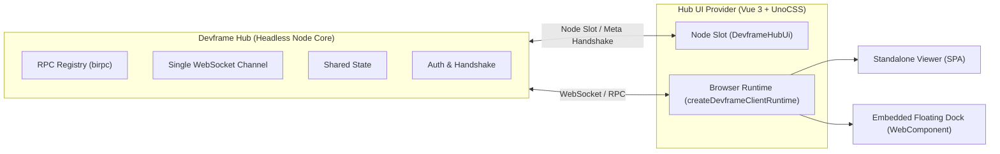
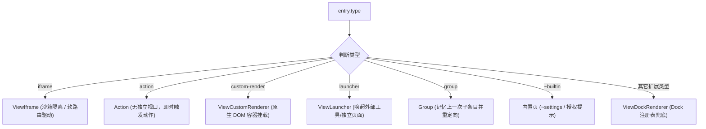

# Devframe Hub UI 架构契约与看板开发规范

> **本文档定位**：作为 uni-helper devtools 重构以及后续所有 DevTools 面板、看板（Dashboard）、Dock 插件的**最高设计契约与实现规范**。后续开发不论新增何种业务视图或 UI 扩展，均需严格遵守本文档定义的契约，确保与 Devframe 生态无缝兼容且不发生架构偏移。

> [!TIP] > **开发核心箴言（一句话总结）**：
> **“里子”抄 Vue DevTools，“壳子”接 Hub UI 协议——两者不是二选一，是清晰的分层关系。**
>
> - **面板内部（“里子”）**：每个具体业务面板（如“组件树”、“状态检查器”、“网络面板”），直接对齐 **Vue DevTools** 的交互设计与信息架构，因为这是目标 Vue/uni-app 开发者早已熟悉的心智模型；
> - **整体外壳（“壳子”）**：工具的外层容器与框架，严格遵循 **`@devframes/hub-ui`** 的 Dock/Renderer 协议，零成本接入 Vite/Nuxt DevTools 及 Hub 生态，无需重复造轮子发明面板管理、分栏停靠和全局命令面板。

---

## 目录

1. [设计哲学：契约驱动与分层原则](#一设计哲学契约驱动与分层原则)
2. [Node 侧宿主契约：DevframeHubUi 插槽](#二node-侧宿主契约devframehubui-插槽)
3. [浏览器侧运行时契约：DevframeClientContext](#三浏览器侧运行时契约devframeclientcontext)
4. [七大 Dock Entry 渲染分发标准](#四大-dock-entry-渲染分发标准)
5. [Dock-Renderer 外部渲染器扩展协议](#五dock-renderer-外部渲染器扩展协议)
6. [主题规范：唯一硬性视觉契约](#六主题规范唯一硬性视觉契约)
7. [技术栈与样式工程化落地规范](#七技术栈与样式工程化落地规范)
8. [新看板/新面板开发实操指引与避坑清单](#八新看板新面板开发实操指引与避坑清单)

---

## 一、设计哲学：契约驱动与分层原则

Devframe 体系的 Hub 是**无头（Headless）**的。官方 `@devframes/hub-ui` 是官方推荐的参考实现，但框架并未强制要求每个面板的微观像素排版。

开发时需建立的核心 Mental Model：

- **分层关系**：“里子”负责具体的业务检查交互（对标 Vue DevTools），“壳子”负责跨宿主接入与全局控制（遵循 Devframe 协议）。
- **两层解耦**：Hub 负责维护 RPC 注册表、单一 WebSocket 通道、多 Frame 发现、状态同步（SharedState）与鉴权，**不关心 UI 长什么样**；
- **契约驱动**：UI 端通过标准的数据结构与生命周期 Hook 和 Hub 对接。只要遵守 **Node 侧插槽规范** 与 **浏览器侧上下文消费规范**，面板就能在独立网页、嵌入式浮层、Vite DevTools、IDE 等各种形态中自由运行；
- **主题穿透**：唯一硬性约束的视觉规范是**主题继承契约**（容器 `.dark` 类与 `--devframe-primary` 配色重载）。



---

## 二、Node 侧宿主契约：DevframeHubUi 插槽

在服务进程（Node / Vite 插件）中，Hub 实例通过 `initHub({ ui })` 装配 UI 插槽。UI 提供者必须输出符合 `DevframeHubUi` 契约的对象：

```ts
export interface DevframeHubUi {
  /**
   * 1. 独立 Viewer SPA 目录
   * 必须包含静态 HTML/JS/CSS（基于相对路径构建），在 Hub 的根路径 (<base>) 托管。
   * 用户直接访问 http://localhost:<port>/<base> 即可呈现独立开发者控制台。
   */
  viewer?: {
    distDir: string
  }

  /**
   * 2. 嵌入式浮动 Dock 引导脚本
   * 必须是预构建的自包含单文件（Single-file IIFE / ESM）。
   * 宿主页面只需引入 <script type="module" src="<base>embedded.js"> 即可唤起浮动工具条。
   */
  embedded?: {
    entry: string
  }

  /**
   * 3. 动态/内存生成的辅助资产
   * 键为相对于 <base> 的路径，值为生成内容的函数。用于提供无需落盘的即时数据、SVG 或文档。
   */
  assets?: Record<string, () => string | Uint8Array>

  /**
   * 4. 初始化配置 Hook
   * 在 Hub 启动时单次执行，向 ctx.staticConfig.ui 写入全局静态配置（如 branding, dockPreferences 等）。
   * 该配置随首帧连接握手自动传给所有 iframe 和前端客户端，无需二次拉取。
   */
  setup?: (ctx: DevframeHubContext) => void | Promise<void>

  /**
   * 5. 终端交互式 OTP 认证 Banner
   * 终端控制台打印登录令牌/验证码时的美化输出函数，需与 branding.productName 联动。
   */
  authBanner?: AuthBannerFunction
}
```

### 配置声明与类型合并

若 Hub UI 需要下发专属配置，通过 TypeScript 声明合并（Declaration Merging）扩展：

```ts
declare module 'devframe/types' {
  interface DevframeConnectionConfigsRegistry {
    ui: {
      branding?: DevframeBranding
      embeddedVisibility?: 'normal' | 'passive' | 'hidden'
      dockPreferences?: DevframeDockPreferences
    }
  }
}
```

---

## 三、浏览器侧运行时契约：DevframeClientContext

在前端浏览器/Webview 侧，客户端通过调用 `createDevframeClientRuntime()` 连接服务端并初始化响应式上下文对象：

```ts
const context = await createDocksContext(clientType, rpc)
```

该上下文由五大核心支柱构成：

| 支柱           | 字段                   | 职责与能力                                                                                                                                                                |
| :------------- | :--------------------- | :------------------------------------------------------------------------------------------------------------------------------------------------------------------------ |
| **Docks**      | `context.docks`        | 管理已注册条目列表（`entries`）、分组（`groupedEntries`）、当前选中（`selectedId`）、条目切换（`switchEntry` / `toggleEntry`）、客户端动态注册（`register` / `update`）。 |
| **Commands**   | `context.commands`     | 命令中心与命令面板（Command Palette），负责快捷键解析（`Mod+K`、`Esc`）、动态条目命令挂载、执行 action。                                                                  |
| **Renderers**  | `context.renderers`    | 外部自定义渲染器调度器（通过 `createDockRenderersContext` 驱动外部未知 Entry 类型的挂载与销毁）。                                                                         |
| **When**       | `context.when.context` | 提供响应式的条件计算上下文（包含 `clientType`、`dockOpen`、`paletteOpen`、`dockSelectedId`、`popupOpen`）。                                                               |
| **Connection** | `context.connection`   | 暴露底层 WebSocket 状态（`connected`、`connecting`、`disconnected`）与错误事件。                                                                                          |

---

## 四、七大 Dock Entry 渲染分发标准

主视口面板在渲染激活的 Entry 时，根据 `entry.type` 执行路由分发（参考 `packages/hub-ui/src/client/components/views/ViewEntry.vue`）：



### 1. `iframe`（沙箱隔离页面）

- **适用场景**：第三方工具、独立子系统、旧版面板重用；
- **渲染规范**：必须通过 `iframe` 沙箱挂载，支持保持 DOM 缓存以避免切换时反复重载；
- **软路由支持**：若声明了 `subTabs`，需通过 `attachFrameNavClient` 监听 iframe 内部发送的路由与 Tab 变化，将子 Tab 映射为顶级虚拟 Entry；支持刷新后的路由记忆恢复（`consumeBootRoute`）。

### 2. `action`（即时动作）

- **适用场景**：一键清除缓存、一键重启服务、Ping 健康检查；
- **渲染规范**：**不占用中央视口面板**。点击后直接执行其绑定的 `clientScript`；
- **多窗口委托**：如果处于弹窗模式（PiP/Popup），需通过 `triggerMainFrameDockAction` 委托至主页面环境执行，避免在孤立窗口中误跑上下文。

### 3. `custom-render`（自定义挂载）

- **适用场景**：以纯原生 JS/DOM 方式动态挂载的面板，无需 iframe 隔离；
- **渲染规范**：提供一个干净的 DOM 容器，载入条目绑定的 `action.importFrom` 脚本并传入容器进行渲染。

### 4. `launcher`（外部发射器）

- **适用场景**：外部文档链接、IDE 外部唤起（如 VSCode、微信开发者工具外部窗口）；
- **渲染规范**：展示启动提示卡片、一键打开按钮与外部协议调用。

### 5. `group`（分组条目）

- **适用场景**：将功能相近的多个 Dock（例如数据看板组、性能监测组）折叠收拢；
- **交互规范**：
  - 点击折叠栏上的组图标时，优先通过 `resolveGroupPreferredChild` 重定向至**该组最近一次打开的子条目**；
  - 若无历史记忆，重定向至配置的 `defaultChildId`；
  - 若均为配置，呼出子条目侧边栏或 Popover 浮层供用户点选。

### 6. `~builtin`（内置视图）

- **适用场景**：Hub UI 自身的核心管理视图（如 `~settings` 设置面板、`~client-auth-notice` 客户端鉴权提示）；
- **渲染规范**：保留系统级特殊 ID 前缀 `~`，享有最高路由匹配优先级。

### 7. 未知扩展类型（Fallback）

- 对任何未来新增或非原生内置的 Entry 类型（如 `json-render`、`chart-view` 等），必须统一由 `ViewDockRenderer` 接管并走 Dock-Renderer 协议，严禁直接白屏或崩溃。

---

## 五、Dock-Renderer 外部渲染器扩展协议

针对自定义的渲染类型，通过 `createDockRenderersContext` 实现插件化挂载（参考 `packages/hub-ui/src/client/components/views/ViewDockRenderer.vue`）：

```ts
export interface DockRenderer<T = any> {
  mount: (entry: T, container: HTMLElement, context: DevframeClientContext) => Promise<{
    dispose: () => void
  }>
}
```

### 挂载生命周期三状态机

任何消费该接口的视图容器必须严格处理以下三种状态：

1. **`mounted`（正常挂载）**：
   - 挂载成功，捕获返回的 `dispose` 函数；
   - 当 Entry 切换、组件销毁或页面关闭时，**必须执行 `dispose()` 释放内存**，防止内存泄漏或后台驻留定时器。
2. **`missing-renderer`（缺失渲染器）**：
   - 在挂载前先行调用 `context.renderers.has(entry.type)` 检测；
   - 若未注册，展示优雅缺省提示（提示用户宿主未注册该渲染模块）。
3. **`load-error`（加载或执行异常）**：
   - 捕获动态 `import()` 或挂载抛出的异常；
   - 展示详细错误描述并提供 **Retry（重试）** 按钮支持原位重新挂载。

---

## 六、主题规范：唯一硬性视觉契约

> [!IMPORTANT]
> 文档中与视觉相关的**硬性约定只有一条——主题（Theme）契约**。任何看板和面板无论使用何种组件库或是否封装在 Shadow DOM 内，都必须严格满足以下两条。

### 1. 容器实时 `.dark` / `.light` Class 契约

- **根节点与挂载容器约束**：
  - 无论在 Light DOM 还是 Shadow DOM 内部，最顶层的根容器（`devframes-color-root`）以及所有外部渲染器的挂载挂载点（`container`）上，**必须实时绑定当前的主题 Class**：
    ```html
    <div ref="container" class="h-full w-full" :class="isDark ? 'dark' : 'light'" />
    ```
  - 必须显式声明 CSS 属性 `color-scheme: dark | light`，保证原生表单输入框、滚动条（Scrollbar）在双色模式下均获得原生平滑渲染。

### 2. CSS 自定义变量继承与 `--devframe-primary` 配色重载

- **色彩通道**：
  - 全局默认主色定义在 `--devframe-primary`（官方默认采用鼠尾草绿 `#3a6a45`）。
  - 下层所有面板的组件库（包括 `@antfu/design`、UnoCSS 语义类、自定义按钮）在声明高亮、激活态背景或阴影时，**禁止使用硬编码色值**，必须通过 `var(--devframe-primary)` 或 UnoCSS 衍生工具取色。
- **动态重配色机制（Re-tinting）**：
  - 当用户在 `branding.primaryColor` 指定品牌色，或者某一个分组配置了独立的 `accentColor` 时，外层容器会就地重写 `--devframe-primary`：
    ```html
    <div :style="{ '--devframe-primary': group.accentColor }">
      <!-- 内部所有子组件自动继承该强调色，无需逐个传参 -->
    </div>
    ```

---

## 七、技术栈与样式工程化落地规范

为保证各面板风格协调一致且打包产物体积极简，统一推荐以下技术选型：

1. **核心逻辑**：
   - **Vue 3 (`<script setup lang="ts">`)** + **Composition API**；
   - 响应式状态管理优先采用原生 `ref` / `computed` / `reactive`，不引入冗余的全局 Store。
2. **UI 组件库**：
   - 采用轻量且自适应主题的 **`@antfu/design`**（提供 `ActionButton`、`ActionIconButton`、`DisplayBadge`、`DisplayKbd` 等现代简约风格组件）。
3. **原子化 CSS 引擎**：
   - 采用 **UnoCSS** 搭配 `@antfu/design` 预设；
   - **Shadow DOM 兼容策略**：
     - 若组件渲染在 Web Component 的 Shadow Root 中，UnoCSS 的 base preset 必须使用 **Wind3（`presetWind()`）**，**严禁使用 Wind4**；
     - _原因_：Wind4 将变量放在全局 `:root` 并使用 `@property { inherits: false }`，无法穿透 Shadow DOM 边界；而 Wind3 会直接编译为具体的 `rgb()` 与 `.dark` 变体；
     - 必须使用 `namespaceShadowCssVars(css, '--un-hub-')` 将内部 `--un-*` 变量添加专属前缀，避免与宿主页面的 UnoCSS 变量互相污染。

---

## 八、新看板/新面板开发实操指引与避坑清单

在后续为 DevTools 增加新功能看板（如网络抓包看板、组件树面板、Storage 管理器等）时，请严格按以下步骤推进：

### 1. 实操分层原则：“里子” vs “壳子”

开发者在做需求时，极易把“面板里的功能”与“面板外的容器”搅在一起。必须时刻牢记以下分层：

| 层次                       | 核心策略              | 具体对标与职责                                                                                                                                                                                                                                                                                                                                                                                                                                                                                     | 为什么这么做                                                                                                                     |
| :------------------------- | :-------------------- | :------------------------------------------------------------------------------------------------------------------------------------------------------------------------------------------------------------------------------------------------------------------------------------------------------------------------------------------------------------------------------------------------------------------------------------------------------------------------------------------------- | :------------------------------------------------------------------------------------------------------------------------------- |
| **里子（Panel Interior）** | **对标 Vue DevTools** | - **双栏/多栏布局**：左侧树状列表、右侧变量与详情，中间支持 Splitter 拖拽调整宽度。<br>- **树状过滤与高亮**：顶部实时搜索框，键入关键词后模糊匹配并自动展开包含匹配项的节点树。<br>- **清晰的数据类别与 Badge**：严格区分 `Setup (ref / reactive)`、`Data ($data)`、`Props`、`Computed`，辅以不同色调徽标。<br>- **行内快速编辑**：点击数字/文本即可行内编辑或展开 JSON 树，`Enter` 保存、`Esc` 还原，支持即时类型提示。<br>- **组件与文件直达**：顶部展示组件源码路径与“在编辑器中打开”快捷动作。 | 这是 Vue/uni-app 开发者早已建立的**直觉心智模型**。直接抄现有最成熟的交互，用户学习成本为 0，上手即用。                          |
| **壳子（Outer Shell）**    | **对接 Hub UI 协议**  | - **Dock 注册**：通过 `id`、`title`、`icon`、`category` 声明条目。<br>- **命令面板联动**：注册命令到 Command Palette（`Mod+K`），支持键盘极速跳转。<br>- **多宿主自适应**：在独立全屏页面（Standalone）、宿主嵌入浮条（Embedded）、Vite/Nuxt DevTools 页签中自动适配合适的外壳形态。<br>- **双色主题贯穿**：响应式同步 `.dark` / `.light`，只消费 `--devframe-primary` 衍生变量，确保随全局 Branding 自动重配色。                                                                                  | 避免重新发明面板管理、分类分栏、快捷键系统、权限握手与断线重连等基础设施，**零成本挂载进现有的 Devframe / Vite DevTools 生态**。 |

### 2. 新增面板标准四步法

```text
[Step 1] 定义 Wire 契约 (agent 侧导出 RPC，禁止浏览器专有 API)
   ↓
[Step 2] Node 侧中继 (relay 注册与转发，对接 DevframeDefinition)
   ↓
[Step 3] UI 侧实现 Vue SFC (遵守 .dark 容器规范与 --devframe-primary 变量，内部交互抄 Vue DevTools)
   ↓
[Step 4] 注册 Dock Entry (声明 id, title, icon, category, type: 'iframe' | 'custom-render')
```

### 3. 核心避坑清单（血泪经验归纳）

1. **严禁手写 Birpc 编解码**：
   - Devframe 内部使用了基于 `structured-clone` 的定制帧编码（响应帧携带 `s:` 前缀）。面板必须统一通过官方客户端建立连接：
     ```ts
     import { connectDevframe } from './df-client.mjs'
     const client = await connectDevframe({ authToken: token, simpleAuth: false })
     const myRpc = client.scope('uni-helper-devtools').rpc
     ```
2. **鉴权令牌与 SimpleAuth 弹窗抑制**：
   - 页面初始化时需从 `location.search` 中解析 `devframe_auth_token`，并在连接时显式传入 `{ authToken, simpleAuth: false }`。若漏传会触发终端临时验证码弹窗，破坏开发体验。
3. **局域网与 Localhost 绑定一致性**：
   - 小程序与真机联调时 Node 服务默认绑定局域网 IP（如 `192.168.x.x`），面板 URL 与 WebSocket 地址必须严格同源对齐，禁止混用 `localhost` 导致 `ECONNREFUSED`。
4. **Vue 3 setupState 变量读写穿透**：
   - Vue 3 的 `instance.setupState` 是经过 `proxyRefs` 包装的代理对象。读取时 ref 会被自动解包成原始值（`type: 'value'`）；在写回修改时，直接对 `setupState[key] = value` 进行赋值，代理底层的 setter 会自动写回真实 `ref.value` 并触发视图响应更新。
5. **可选 Peer 依赖的完整性（`vue-afloat`）**：
   - `@antfu/design` 中的按钮组件（如 `ActionIconButton.vue`）默认引用了 `vue-afloat` 的 `vTooltip` 指令。任何引入该组件的工程必须显式安装 `vue-afloat`，避免 Vite 打包出空模块导致前端挂载崩溃。

---

_文档版本：v1.0.0_
_维护团队：uni-helper devtools 重构工作组_
